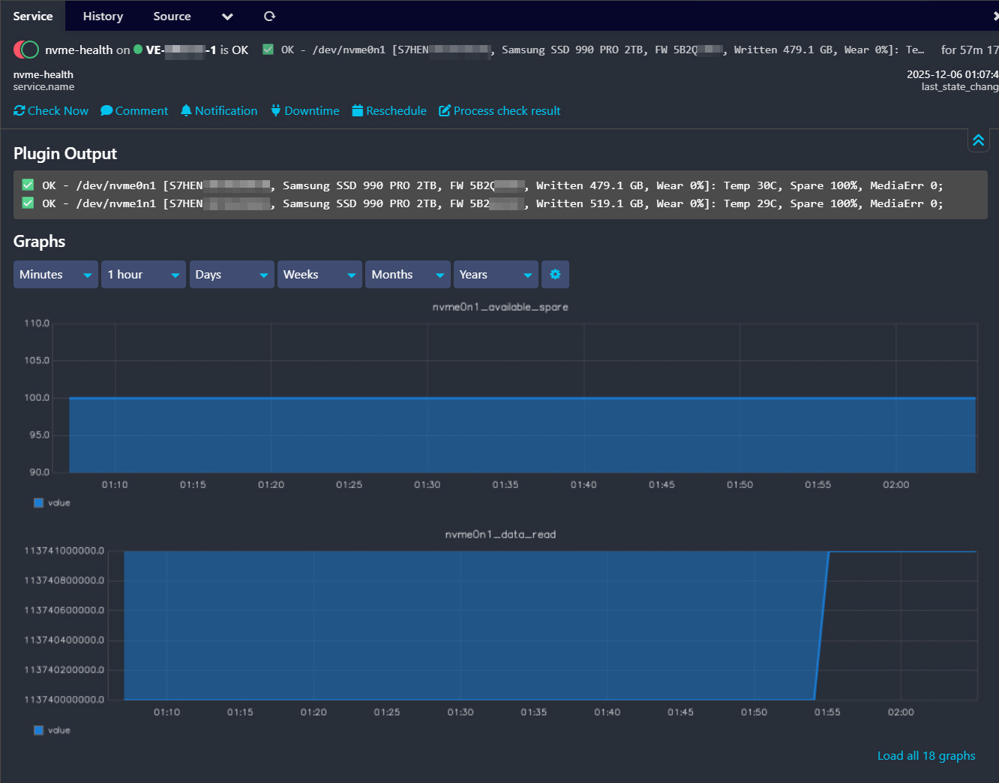

# check_nvme_smart_all
This plugin checks all NVMe devices on the system using nvme-cli in json mode, collects SMART data and reports to Nagios/Icinga via NRPE.

#### NVME Perfdata collection:

# Requirements:
   - Perl with JSON module
   - nvme-cli installed (usually /usr/sbin/nvme)
   - NRPE installed and running
   - nagios user must have sudo access for nvme commands (see below)

# NRPE / sudo setup example:
   1. Install NRPE:
        apt install nagios-nrpe-server nagios-plugins
   2. Create sudoers file:
        sudo visudo -f /etc/sudoers.d/nvme-nagios
        Add line:
           nagios ALL=(root) NOPASSWD: /usr/sbin/nvme smart-log *, /usr/sbin/nvme list -o json
        chmod 440 /etc/sudoers.d/nvme-nagios
   3. Test as nagios user:
        sudo -u nagios sudo nvme list -o json
        sudo -u nagios sudo nvme smart-log /dev/nvme0n1 -o json
   4. Modify this script to call 'sudo nvme ...'

# Variables / thresholds:
   TEMP_WARN / TEMP_CRIT       - Temperature Celsius
   SPARE_WARN / SPARE_CRIT     - Available spare %
   MEDIA_CRIT                  - Media errors threshold
   UNSAFE_CRIT                 - Unsafe shutdowns threshold (100)
